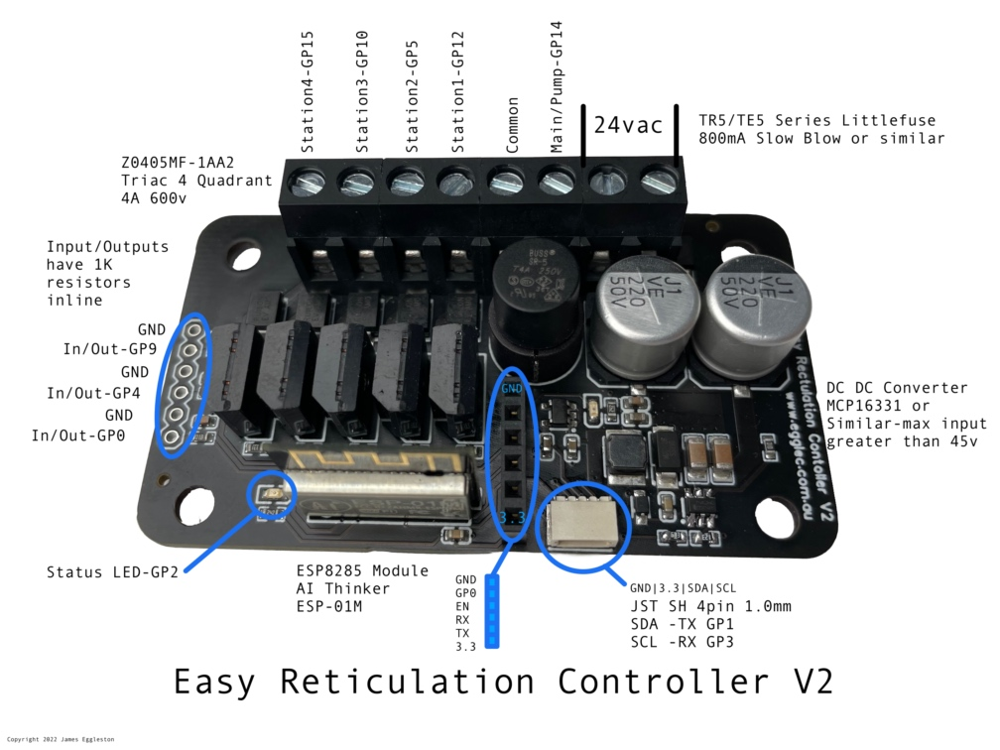

# About
The Easy-Reticulation Controller is designed to be small, simple to use, low cost, versatile and customizable. I have found most people only use up to 3 zones and a master solenoid at most. So I designed a small simple controller that would work with Home Assisant, could be mounted inside a Allbro ENL160806P case and could also be used to retrofit into an existing old school controller if you already have one, to save on the need to buy a case or 24v transformer to run everything via WIFI.
# Where to get one
It is available at https://www.egglec.com.au/blank
And you can make your own for personal use
https://oshwlab.com/james_6977/easy-reticulation-controller-v2

# Firmware Installation
Your device would have come installed with firmware but if you want to upgrade it or you have a new device then you can do that here with an FTDI adaptor connected to the header pins on your board. You will need to place it in download mode by bridging GPIO0 with GND.
You can use the button below to install the lastest pre-built firmware directly to your device via USB from the browser.

<esp-web-install-button manifest="./manifest.json"></esp-web-install-button>

# Instructions

- DO NOT EVER CONNECT TO MAIN LEVEL VOLTAGE IT IS DESIGNED FOR 24vAC safety isolated by a transfromer.
- Connect the device to a 24v AC power supply as is usual for reticulation systems
- Once connected the default duration for each station is 10 minutes
- If a momentary push button (Normally Open) is connect to GPIO 9 on the left handside and ground this will start the program and cycle to the next station
- If an LED (red) is connected to GPIO 4 on the left handside and ground this will signal the station that is runnings
- It has an on board fuse TR5/TE5 Littlefuse 800mA Slow Blow
- AC has no polarity so the transformer leads at 24Vac can go to to either 24vac terminal. It would like work with DC as well but I've not actually tried it, but it would only work with the correct polarity, which is not indicated as it is designed for AC
- Station Terminal 1 or M is the Main Solenoid this will turn on whenever 1,2,3 or 4 are on this could running a main solenoid or a 24vac contactor to turn on a bore pump
- Station Terminals 1, 2, 3, and 4 are the 4 Station that will connect to the other side of each Zone or Solenoid in your system
- Connect your phone or computer to the AP the device creates EG. easy-reticulation-D2f682 there is no password
- Wait....be patient and dialog should pop up and you may enter your SSID and PASSWORD, the device is available at 192.168.4.1 if no popup comes up, but you will need to wait still for it to be active
- Once connected to your network Home Assistant will discover it in configuation/integrations area if it does not you will need to find out the devices IP on your router, and select add new device in the bottom right corner and then enter the IP address your DHCP as given the device
- Once Created it will make 14 entities it will make all the necessary entities in HA for you this includes:
- 4 x Station Duration set these to enter the run time in minutes of each station the device will time the duration and turn off the station when finished so you only need to setup and automation in HA to start the station running, if you ever want to change the run time place the Station Duration Entities in your Dashboard.
- 4 x Stations switches turn these on to start and stop a station running if you allow google home or alexa to access the switch you can ask it to turn on (example: Station One) and Station 1 will run for it's set duration
- 5 x Switch that will disabled by default that directly operate the solenoids
- 1 x Status Text Sensor that tell you what the system is currently doing

The Device can of course be reprogrammed as you would like too, if you have ESPhome installed, the ESPhome dashboard will allow you to import and install the YAML code from this repository simply by ADOPTING the device into your system. You can also manually copy this code or any YAML code that is valid as you wish into a newly setup device.  If you need would like to change the name of the device, this will prevent the new yaml uploading, in the wifi section uncomment out use_address: and enter the device's current IP or network name ie easy-retitulation.local once the new code has been has been uploaded you can comment out use_address: again as the name will be used to access the device.
