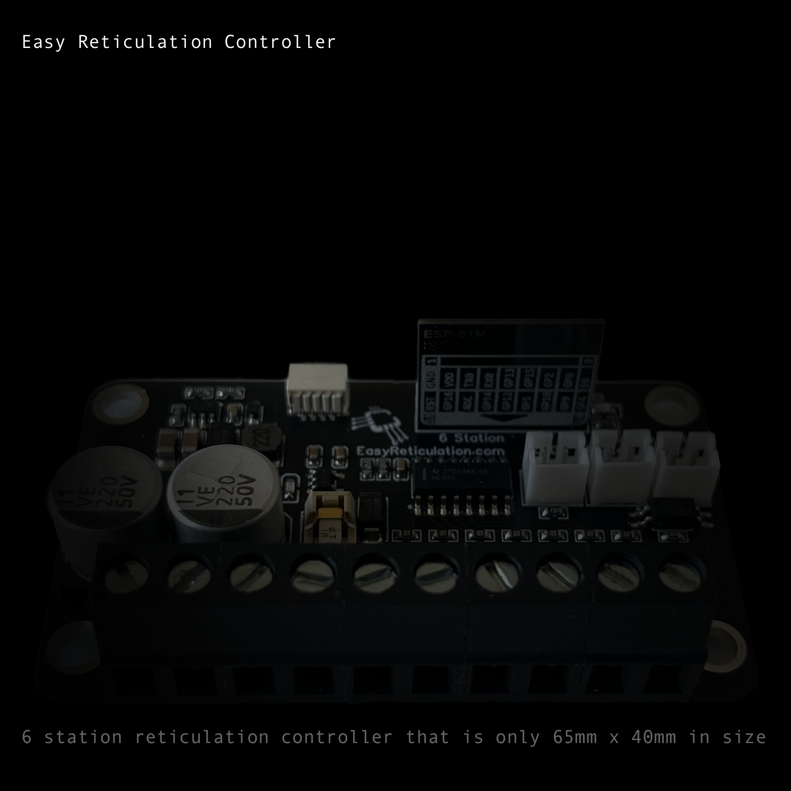
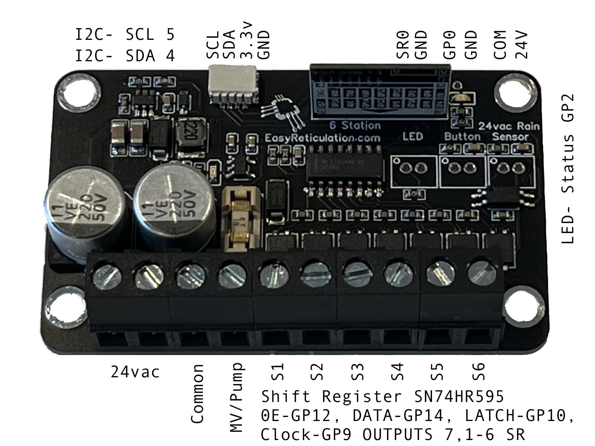

# About
The Easy-Reticulation Controller is designed to be small, simple to use, low cost, versatile and customizable. I have found most people only use up to 3 zones and a master solenoid at most. So I designed a small simple controller that would work with Home Assisant, could be mounted inside a Allbro ENL160806P case and could also be used to retrofit into an existing old school controller if you already have one, to save on the need to buy a case or 24v transformer to run everything via WIFI.

More information and instruction are available at my YouTube(https://www.youtube.com/@SparkyJames)
# Where to get one
It is available at [MY WEBSTORE](https://www.egglec.com.au/product-page/easy-reticulation-controller-v3)

And you can make your own for personal use at [OSHWLAB](https://oshwlab.com/circular-motion/easy_retic_v3_public)

# Firmware Installation
Your device would have come installed with firmware but if you want to upgrade it or you have a new device then you can do that here with an FTDI adaptor connected to the appropriate UART on your board. You will need to place it in download mode by bridging GPIO0 with GND, which are conveniently the pads for the external push button.
You can use the button below to install the lastest pre-built firmware directly to your device via USB from the browser.

<esp-web-install-button manifest="./manifest.json"></esp-web-install-button>

# Instructions

- DO NOT EVER CONNECT TO MAINS LEVEL VOLTAGE IT IS DESIGNED FOR conection via a 24vAC safety isolated by a transfromer.
- Connect the device to a 24v AC power supply as is usual for reticulation systems
- Once connected the default duration for each station is 10 minutes
- If a momentary push button (Normally Open) is connect to GPIO O marked button on the board and ground this will start the program and cycle to the next station
- If an LED (red) is connected to the SR0(Shift Register Output 0) marked LED and ground this will signal the station that is running
- It has an on board minature fuse holder NANO2 Littlefuse 1A Slow Blow
- AC has no polarity so the transformer leads at 24Vac can go to to either 24vac terminal.
### NOTE IF WIRING IN PARALLEL WITH EXISTING INCORRECT POLARITY CAN DAMAGE THE DEVICE, PLEASE FOLLOW INSTRUCTS FOR PARALLEL INSTALLATION
- MV or PUMP is the Main Solenoid or a 24vac pump start relay, this will turn on whenever 1,2,3, 4, 5 or 6 are on.
- Common is the common voltage for your system and is usually black(but not always)
- Station Terminals 1-6 will connect to the other side of each Zone or Solenoid in your system
- Connect your phone or computer to the AP the device creates EG. easyv3 there is no password
- Wait....be patient and dialog should pop up and you may enter your SSID and PASSWORD, the device is available at 192.168.4.1 if no popup comes up, but you will need to wait still for it to be active
- Once connected to your network Home Assistant will discover it in configuation/integrations area if it does not you will need to find out the devices IP on your router, and select add new device in the bottom right corner and then enter the IP address your DHCP as given the device
- Once Created it will make 22 entities it will make all the necessary entities in HA for you this includes:
- 6 x Station Duration set these to enter the run time in minutes of each station the device will time the duration and turn off the station when finished so you only need to setup and automation in HA to start the station running, if you ever want to change the run time place the Station Duration Entities in your Dashboard.
- 6 x Stations switches turn these on to start and stop a station running if you allow google home or alexa to access the switch you can ask it to turn on (example: Station One) and Station 1 will run for it's set duration
- 7 x Switches that will disabled by default that directly operate the solenoids
- 1 x Status Text Sensor that tell you what the system is currently doing
- 1 x Binary sensor for the rain sensor
- 1 x Binary seonsor for the external button

The Device can of course be reprogrammed as you would like too, if you have ESPhome installed, the ESPhome dashboard will allow you to import and install the YAML code from this repository simply by ADOPTING the device into your system. You can also manually copy this code or any YAML code that is valid as you wish into a newly setup device.  If you need would like to change the name of the device, this will prevent the new yaml uploading, in the wifi section uncomment out use_address: and enter the device's current IP or network name ie easy-retitulation.local once the new code has been has been uploaded you can comment out use_address: again as the name will be used to access the device.

# Parallel Installation
In order to install the device in parallel to an existing system, please see the You Tube video on my channel @SparkyJames
Turn off the power to the device:
1. Connect the stations from each station 1 - 6 from the Easy Retic to the existing
2. Connect the 3rd terminal (COMMON) to common on your existing controller
3. Connect either of the 24vac supply wires to the Easy Retic
4. Turn on the power, if the power light comes on and the status light starts flashing you are ready to go, if not go to the last step ->
5. Connect terminal 1 on the Easy Retic to the other 24vac terminal on the existing controller and you should be good to continue
